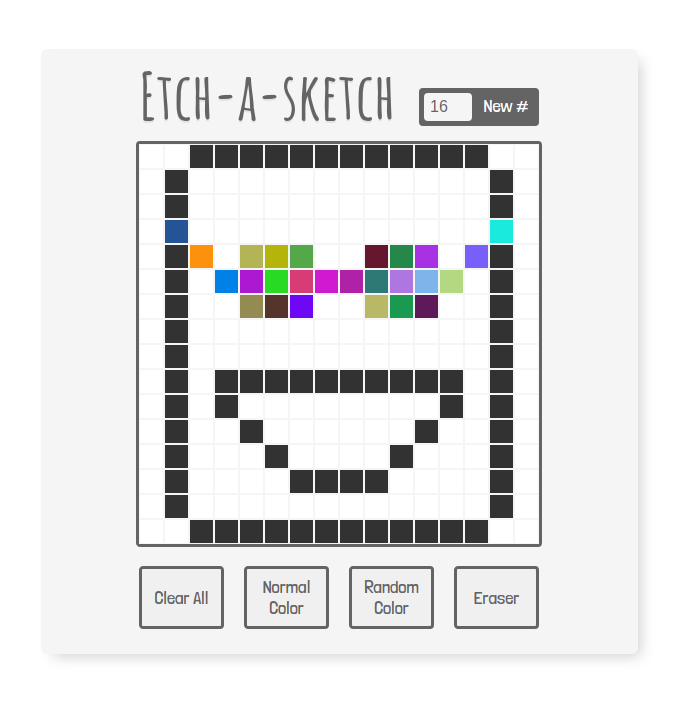

# Etch A Sketch

A pixel drawing browser application -- similar to an [etch-a-sketch](https://en.wikipedia.org/wiki/Etch_A_Sketch), with some extra features (mentioned below).

## Example
[Check this out in action](https://jmilll.github.io/etch-a-sketch/)

## Motivation

The purpose of this project was to learn and understand manipulation of the Document Object Model (DOM) through user interactions.

## Technologies Used

* HTML / CSS
* JavaScript

## Features

* Change grid size between 2x2 and 75x75 with the click of a button.
* 'Clear All' wipe your board to create a new drawing.
* 'Normal Color' black lines for that classic feel.
* 'Random Color' cells change to continously random colors for when you want to have fun.
* 'Eraser' to allow for pixel drawings without a trail.

## Acknowledgements

This project was inspired by [The Odin Project](https://www.theodinproject.com/home) online learning curriculum.

## License

MIT